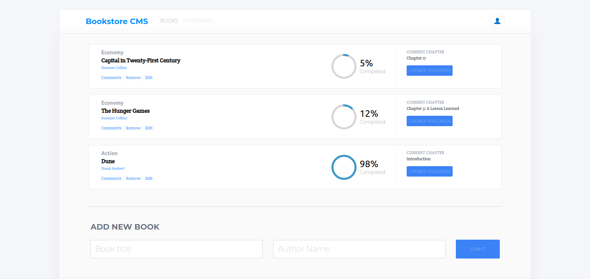

# Book Store CMS
Book store CMS is a react project that enable users to create and remove books. This project also leverage the use of redux.

Application Demo                                                                                             |
:---------------------------------------------------------------------------------------------------:|
                                                                      |

Application Screenshot                                                                               |
:---------------------------------------------------------------------------------------------------:|
                                                                      |


## Online versions
[Live Version](https://bookstore-cms-app.herokuapp.com/)

## Built With

- React & Redux

## How to run the program locally
- Clone the project: ```https://github.com/mmsesay/bookstore-cms.git```
- Skip if you already have node installed otherwise download [nodejs](https://nodejs.org/en/download/) install it on your system
- Install the node modules: ```npm install```
- Run the app: ```npm start``` or ```yarn start```

## Author

👤 **Muhammad Mustapha Sesay**

- GitHub: [@mmsesay](https://github.com/mmsesay)
- Twitter: [@DeeMaejor](https://twitter.com/DeeMaejor)
- LinkedIn: [Muhammad M Sesay](https://linkedin.com/in/muhammad-m-sesay)


## 🤝 Contributor

Contributions, issues, and feature requests are welcome!

Feel free to check the [issues page](../../issues/).

## Show your support

Give a ⭐️ if you like this project!

## Acknowledgments
- microverseinc for the readme template
## 📝 License

This project is [MIT](./MIT.md) licensed.